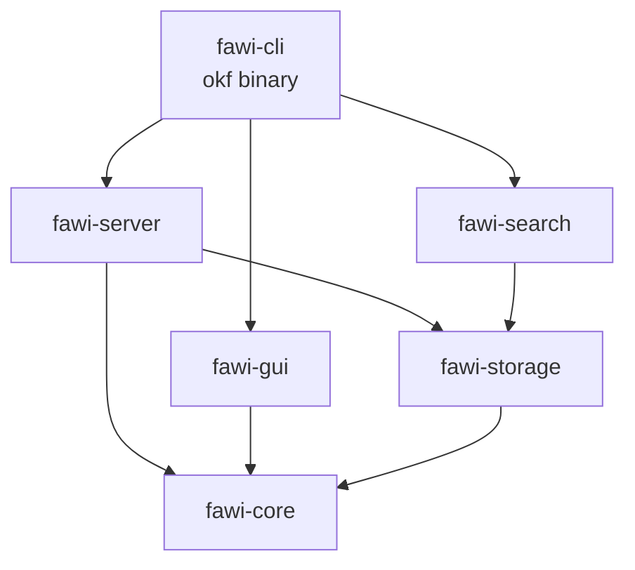
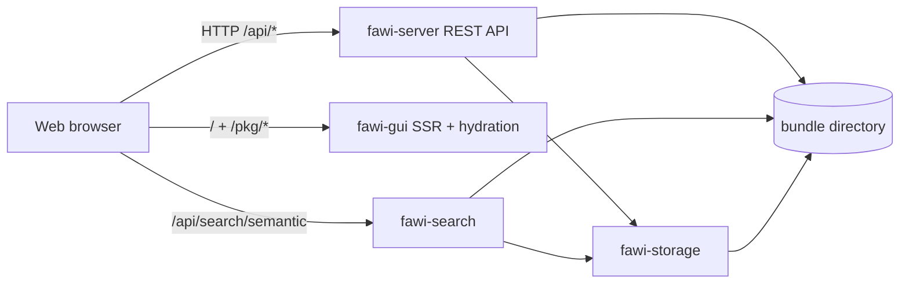

# Architecture

The project is a Cargo workspace with six crates.

# Schema

| Crate | Role |
| --- | --- |
| `fawi-core` | OKF model, front matter parsing, markdown rendering, DTOs. |
| `fawi-storage` | Read-only bundle scanner and change events. |
| `fawi-server` | REST API and WebSocket (the `fawi-server` binary). |
| `fawi-gui` | Leptos web UI (the `fawi-gui` binary). |
| `fawi-search` | Semantic search over bundle embeddings (the `fawi-search` binary). |
| `fawi-cli` | Unified `okf` launcher that starts the server, GUI, and search. |

# Data flow

The `okf` binary (from `fawi-cli`) opens the bundle once and serves the REST API,
web UI, and semantic search as a single merged axum router on one socket. The web
UI never touches the bundle directly; it queries the REST API over HTTP — both
during server-side rendering and after hydration — using the same origin, which
is what makes client-side navigation work without a proxy.

`fawi-server` and `fawi-search` read the bundle directory through `fawi-storage`.
Changes on disk are detected by `notify` and broadcast to WebSocket clients, so
the UI can reload the sidebar and the current page automatically. See
[Hot reload](api/websocket.md).
